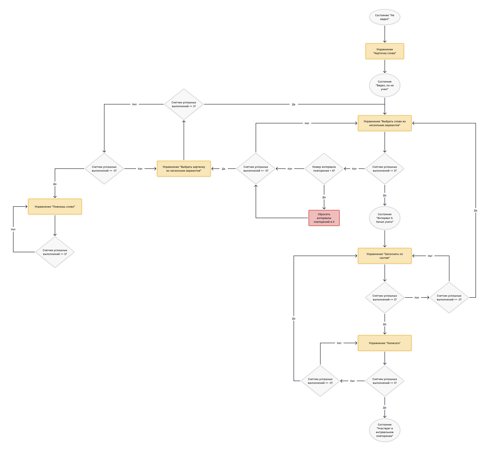

# Стратегия запоминания

Мы основываемся на [методе интервальных повторений](https://ru.wikipedia.org/wiki/Интервальные_повторения)

Формула для интервальных повторений: `Y = 2X + 1`

Где:
- Y - день, когда информация начнет забываться
- X - день последнего повторения

Если в упражнении "Помнишь слово" пользователь ответил "нет" то слово устанавливается в состояние "Не выучено"

Градация упражнений по степени запоминания (1 - низшая степень):
0. [Карточка слова](./ExcerciseTypes/JustWord.md)
1. [Помнишь слово](./ExcerciseTypes/DoYouRemember.md)
2. [Выбрать картинку из нескольких вариантов](./ExcerciseTypes/ChooseOneFrom.md)
3. [Выбрать слово из нескольких вариантов](./ExcerciseTypes/ChooseOneFrom.md)
4. [Заполнить по частям](./ExcerciseTypes/WriteOneByOne.md)
5. [Написать](./ExcerciseTypes/Write.md)

Состаяния слова:
1. Не видел  - когда не выполнял упражнение `0`
2. Видел, но не учил - выполнил упражнение  `0`
3. Интервал 0. Начал учить - выполнил упражнение `1` | `2` | `3`.
4. Участвует в интрвальном повторении. Выполнил упражнение `5`

Принципы:
- Если пользователь еще не видел этого слова, то сперва он должен получить просто [карточку слова](./ExcerciseTypes/JustWord.md)
- Если пользователь получил карточку слова, то он может получить упражнения `1` | `2` | `3`
- Если пользователь `3` раза успешно ответил на упражнение уровня `N` то он далее получает задания уровня `N+1`
- Если пользователь `3` раза выполнил последнее упражнение без подсказок, то слово считается выученым и для него начинает действовать метод интервальных повторений
- Если пользователь `3` раза делает ошибку, то откатывается на предыдущий уровень
- Если пользователь выполняет упражнение с подсказкой, то оно не инкрементирует счетчик успешных выполнений
- Если пользователь не выполняет упражнение с подсказкой, то оно **ДЕКРЕМЕНТИРУЕТ** счетчик успешных выполнений
- Если пользователь получает слово после того как прошел интервал повторения, то упражнение которое он получит зависит от разницы между `X` и `Y`
    - Если разница больше 2-х недель, то пользователь начинает с упражнения `3`
    - Если меньше, то с упражнения `5`
- Если на N-ом интервале пользователь отктился по уровню ниже начального (`3` для > 2-х недель, `5` - для меньше), то счетчик интервалов сбрасывается и слово переходит в состояние "видел, но не учил"

## Схема

